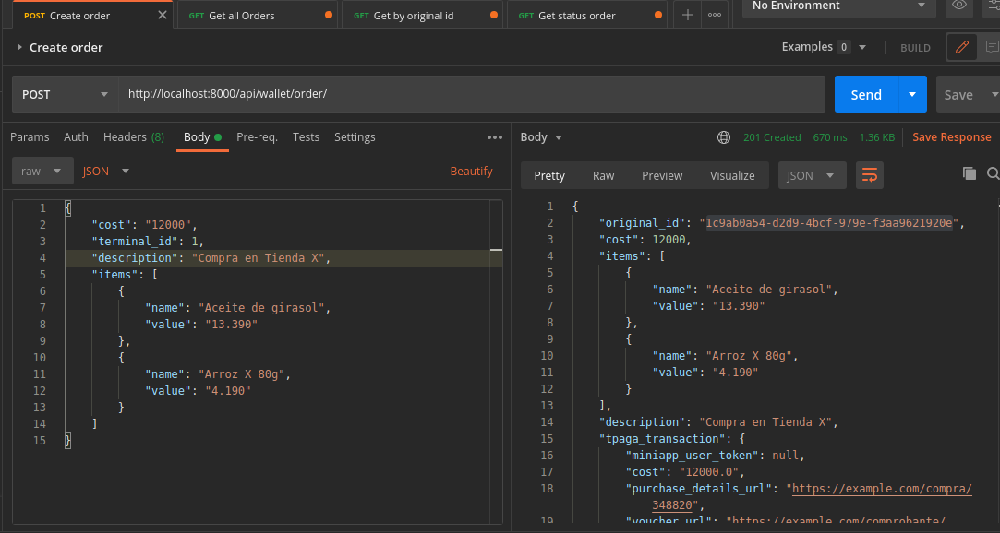
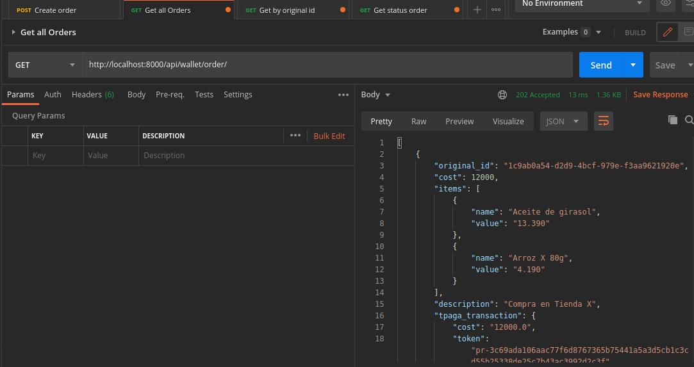
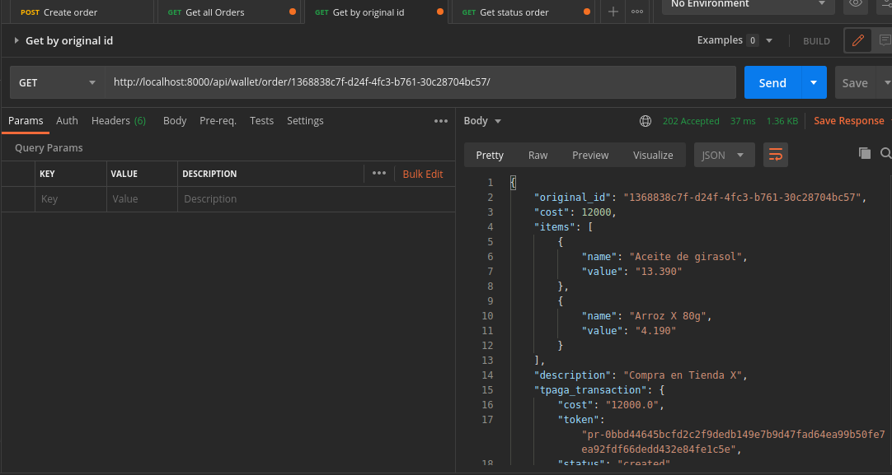
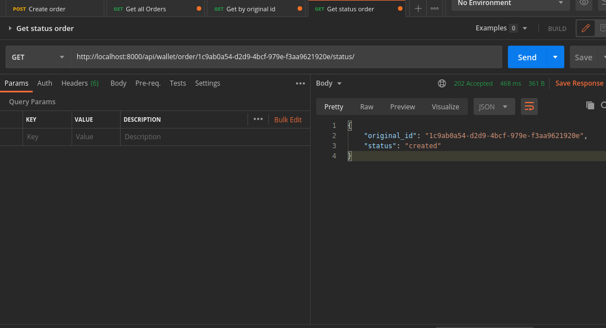

#### ESTIMATED TIME
El tiempo estimado para la resolucion de la prueba es de 2h.

La prueba fue solucionada en 3.5h

#### TASK's

- Integracion con `payment_request` de Tpaga.
    - Definir endpoint `orders/`
    - Definir servicio del endpoint
    - Definir commons donde van a ir las peticiones al API.
    - Crear querys necesarias para creacion de registros en el sistema.

- Integracion con `purchase_details_url` de Tpaga.
    - Definir endpoint `orders/<original_id>/status`
    - Definir servicio del endpoint
    - Definir commons donde van a ir las peticiones al API.
    - Crear querys necesarias para creacion de registros en el sistema.   
    
- Definir endpoint `orders/`
    - Definir servicio del endpoint
    - Definir commons donde van a ir las peticiones al API.
    - Creacion de ordenes en la tienda. 


##### DEPLOY

Primer comando
```
docker-compose up -d --build
```

Segundo comando 
```
docker-compose up
```

##### CURl's 

####### Creacion order
```
curl --location --request POST 'http://localhost:8000/api/wallet/order/' \
--header 'Content-Type: application/json' \
--data-raw '{
    "cost": "12000",
    "terminal_id": 1,
    "description": "Compra en Tienda X",
    "items": [
        {
            "name": "Aceite de girasol",
            "value": "13.390"
        },
        {
            "name": "Arroz X 80g",
            "value": "4.190"
        }
    ]
}'
```



###### Retorna todas las ordenes
```
curl --location --request GET 'http://localhost:8000/api/wallet/order/'
```


###### Retorna una orden por original_id
```
curl --location --request GET 'http://localhost:8000/api/wallet/order/<original-id>/'
```


###### Retorna el estado de la transaccion de una orden en el API de tpaga
```
http://localhost:8000/api/wallet/order/<original-id>/status/
```
